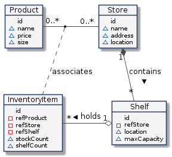

# golangApi
Create a basic api to Crud on DynamoDb

 

#### Initialize project

```sh
 go init github.com/name 
```

#### Simple example
```go
package main

import "fmt"

func main() {
	fmt.Println("Hello World")
}
```
#### How debug?
```json
{
  "version": "2.0",
  "configurations": [
    {
      "name": "Crud",
      "type": "go",
      "request": "launch",
      "mode": "auto",
      "env": {
        "API_ENV": "qa", 
      },
       "args": ["api"],
      "program": "${workspaceFolder}/src/main.go"
    },

  ]
}
```


#### Add Swagger

Install swag

```
go get -u github.com/swaggo/swag/cmd/swag
which swag or find / -name swag
export PATH=$PATH:/System/Volumes/Data/Users/gelson.rodrigues/go/bin

swag init

output

2024/02/14 16:10:32 Generating entities.Product
2024/02/14 16:10:32 Generating entities.ProductResponse
2024/02/14 16:10:32 create docs.go at docs/docs.go
2024/02/14 16:10:32 create swagger.json at docs/swagger.json
2024/02/14 16:10:32 create swagger.yaml at docs/swagger.yaml

```